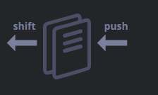

# Array-Methods

## Что такое массив в JavaScript?
_Массив в JavaScript – это упорядоченная коллекция данных. Он позволяет хранить несколько значений в одной переменной и обращаться к ним по индексу._

#### Пример массива:
```js
let fruits = ["Яблоко", "Банан", "Апельсин"];
console.log(fruits[0]); // "Яблоко"
```
### Основные характеристики массива:
- Массивы индексируются, первый элемент имеет индекс 0.
- Можно хранить разные типы данных: числа, строки, объекты и даже другие массивы.

## Методы pop/push, shift/unshift
[Очередь](https://ru.wikipedia.org/wiki/%D0%9E%D1%87%D0%B5%D1%80%D0%B5%D0%B4%D1%8C_(%D0%BF%D1%80%D0%BE%D0%B3%D1%80%D0%B0%D0%BC%D0%BC%D0%B8%D1%80%D0%BE%D0%B2%D0%B0%D0%BD%D0%B8%D0%B5)) – один из самых распространённых вариантов применения массива. В области компьютерных наук так называется упорядоченная коллекция элементов, поддерживающая два вида операций:

- `push` добавляет элемент в конец.
- `shift` удаляет элемент в начале, сдвигая очередь, так что второй элемент становится первым.



_Массивы поддерживают обе операции.

На практике необходимость в этом возникает очень часто. Например, очередь сообщений, которые надо показать на экране.

Существует и другой вариант применения для массивов – структура данных, называемая стек.

Она поддерживает два вида операций:

- `push` добавляет элемент в конец.
- `pop` удаляет последний элемент.
Таким образом, новые элементы всегда добавляются или удаляются из «конца».

Примером стека обычно служит колода карт: новые карты кладутся наверх и берутся тоже сверху:


Массивы в JavaScript могут работать и как очередь, и как стек. Мы можем добавлять/удалять элементы как в начало, так и в конец массива.

В компьютерных науках структура данных, делающая это возможным, называется [двусторонняя очередь](https://ru.wikipedia.org/wiki/%D0%94%D0%B2%D1%83%D1%85%D1%81%D1%82%D0%BE%D1%80%D0%BE%D0%BD%D0%BD%D1%8F%D1%8F_%D0%BE%D1%87%D0%B5%D1%80%D0%B5%D0%B4%D1%8C).

#### Методы, работающие с концом массива:

`pop`

Удаляет последний элемент из массива и возвращает его:

```js
let fruits = ["Яблоко", "Апельсин", "Груша"];

alert( fruits.pop() ); // удаляем "Груша" и выводим его

alert( fruits ); // Яблоко, Апельсин
```
И `fruits.pop()` и `fruits.at(-1)` возвращают последний элемент массива, но `fruits.pop()` также изменяет массив, удаляя его.

`push`

Добавляет элемент в конец массива:

```js
let fruits = ["Яблоко", "Апельсин"];

fruits.push("Груша");

alert( fruits ); // Яблоко, Апельсин, Груша
```
Вызов `fruits.push(...)` равнозначен `fruits[fruits.length] = ....`

#### Методы, работающие с началом массива:

`shift`

Удаляет из массива первый элемент и возвращает его:

```js
let fruits = ["Яблоко", "Апельсин", "Груша"];

alert( fruits.shift() ); // удаляем Яблоко и выводим его

alert( fruits ); // Апельсин, Груша
```
`unshift`

Добавляет элемент в начало массива:
```js
let fruits = ["Апельсин", "Груша"];

fruits.unshift('Яблоко');

alert( fruits ); // Яблоко, Апельсин, Груша
```

`concat()` – объединяет массивы
Создаёт новый массив, объединяя существующие массивы или элементы.
```js
let arr1 = [1, 2, 3];
let arr2 = [4, 5, 6];
let result = arr1.concat(arr2);
console.log(result); // [1, 2, 3, 4, 5, 6]
```

`slice(start, end)` – возвращает часть массива
Копирует элементы массива в новый массив без изменения оригинала.
```js
let arr = ["a", "b", "c", "d"];
let part = arr.slice(1, 3); 
console.log(part); // ["b", "c"]
```
`join(separator)` – соединяет массив в строку
Объединяет все элементы массива в строку, используя указанный разделитель.
```js
let words = ["Привет", "мир"];
console.log(words.join(" ")); // "Привет мир"
```
`includes(value)` – проверяет, есть ли элемент в массиве
Возвращает `true`, если элемент найден, иначе `false`.
```js
let numbers = [1, 2, 3, 4];
console.log(numbers.includes(3)); // true
console.log(numbers.includes(10)); // false
```
`indexOf(value)` – находит индекс элемента
Возвращает индекс первого найденного элемента или `-1`, если элемент отсутствует.
```js
let fruits = ["яблоко", "банан", "апельсин"];
console.log(fruits.indexOf("банан")); // 1
console.log(fruits.indexOf("груша")); // -1
```
`splice(start, deleteCount, ...items)` – удаляет/добавляет элементы
Изменяет массив: удаляет элементы и/или добавляет новые.

```js
let numbers = [1, 2, 3, 4, 5];
numbers.splice(2, 1, "новый"); // Удалит 3, вставит "новый"
console.log(numbers); // [1, 2, "новый", 4, 5]
```
`toString()` – превращает массив в строку
Возвращает строковое представление массива.

```js
let arr = [1, 2, 3];
console.log(arr.toString()); // "1,2,3"
```
`toReversed()` – возвращает перевёрнутый массив (новый)
Создаёт новый массив с элементами в обратном порядке, не изменяя исходный массив.
```js
let arr = [1, 2, 3];
let reversed = arr.toReversed();
console.log(reversed); // [3, 2, 1]
console.log(arr); // [1, 2, 3] (исходный массив не изменился)
```

### Таблица методов массива в JavaScript

Метод |	Описание |	Пример |	Результат
------|----------|---------|-------------
`concat()` |	Объединяет массивы в новый массив	| `arr1.concat(arr2)`	| `["a", "b", "c", "d", "e"]`
`slice(start, end)` |	Возвращает копию части массива	| `arr.slice(1, 3)`	| `["b", "c"]`
`join(separator)` |	Объединяет элементы в строку	| `arr.join("-")`	| `"a-b-c-d"`
`includes(value)` |	Проверяет, есть ли элемент в массиве	| `arr.includes("c")`	| `true`
`indexOf(value) `|	Возвращает индекс элемента или -1, если нет	| `arr.indexOf("b")`	| `1`
`splice(start, deleteCount, ...items)` |	Удаляет и/или добавляет элементы	| `arr.splice(1, 2, "x")`	| `["a", "x", "d"]`
`toString()` |	Преобразует массив в строку	| `arr.toString()`	|` "a,b,c,d"`
`toReversed()` |	Создаёт новый массив в обратном порядке	| `arr.toReversed()`	| `["d", "c", "b", "a"]`


